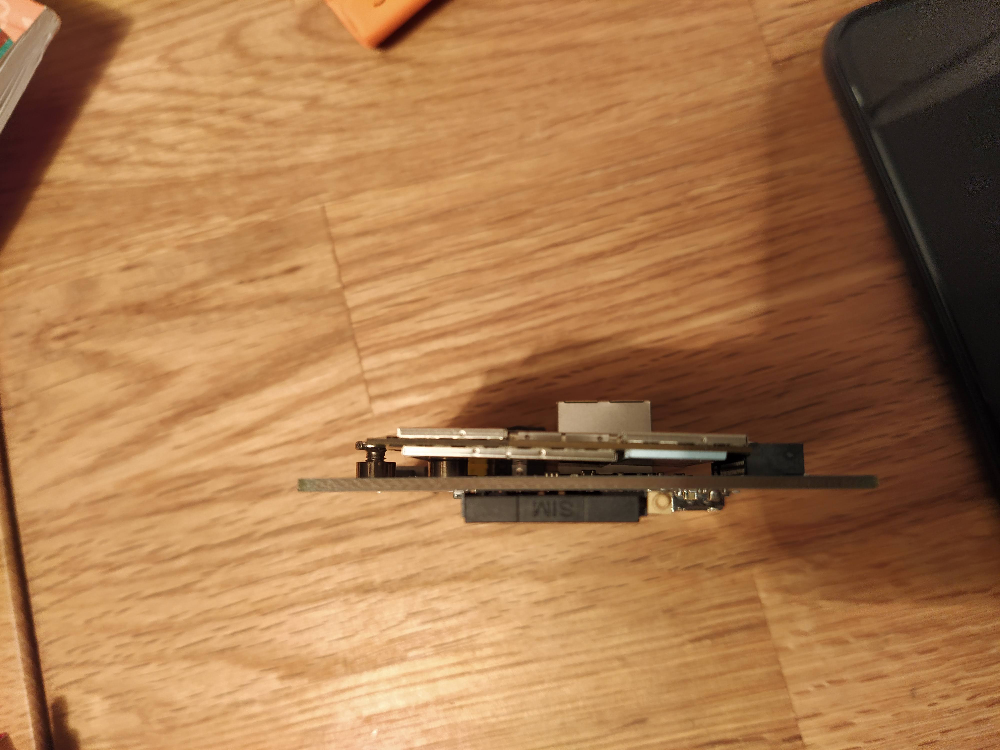
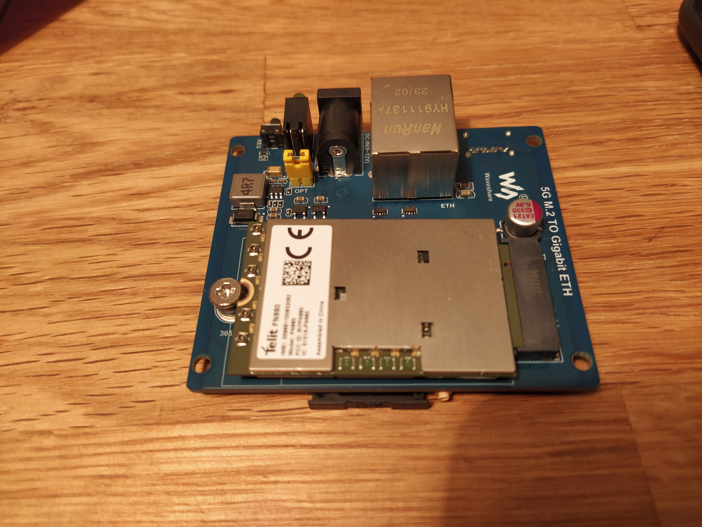
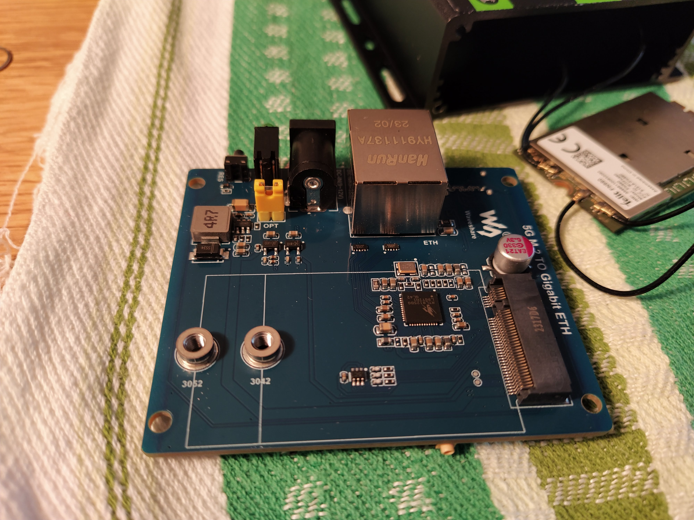
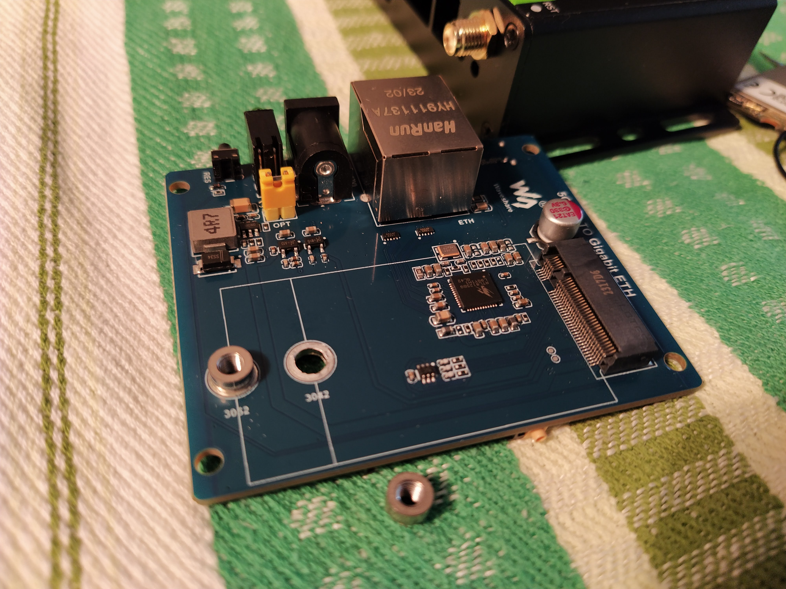
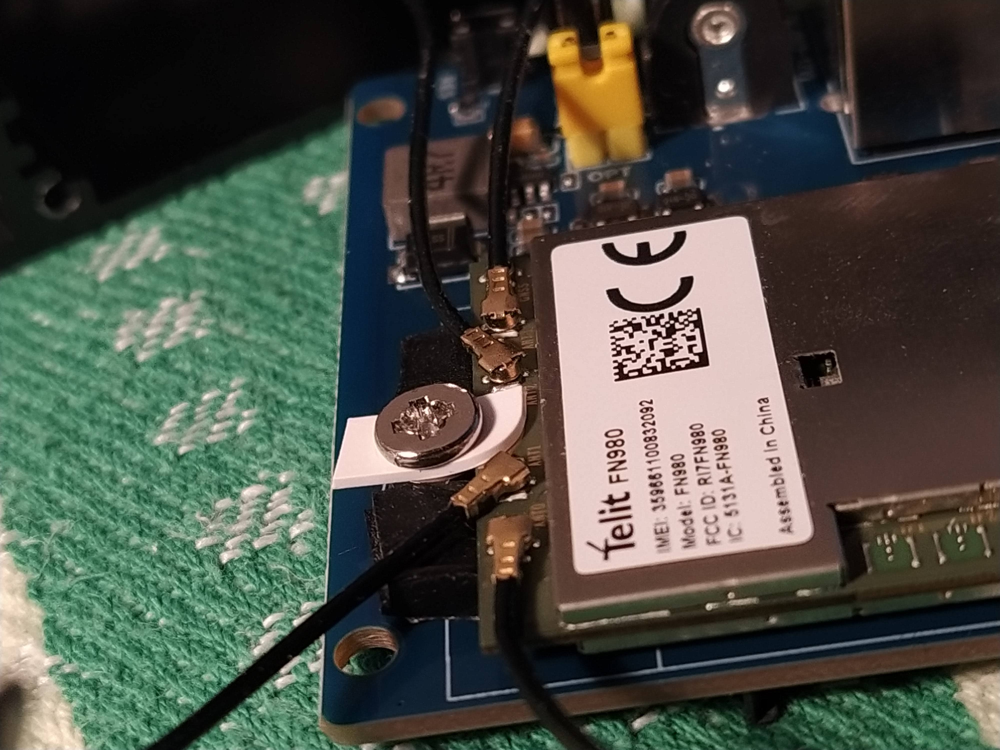

# Telit FN980 in Waveshare 5G M.2 to Gigabit Ethernet

[Telit FN980](https://www.telit.com/devices/fn980-and-fn980m-data-cards-support-5g/)

[Waveshare 5G M.2 to Gigabit Ethernet](https://www.waveshare.com/5g-m.2-to-gigabit-eth.htm)

## Hardware updates
Box accepts 3042 and 3052 M.2 modules. Modem is 3050 module and height is 3.4 mm; components are equipped on both sides of PCB. Standoff nut for 3042 module soldered on Waveshare's board obstacles Telit to be properly mounted:

Screw doesn't hold Telit in place properly:

Both standoff nuts in place:

3042 standoff nut unsolderd:

Telit mounted using pieces of rubber to maintain distance from Waveshare PCB. Piece of plastic helps to hold Telit (which is 2 mm smaller than standard).


## Telit configuration updates
I have connected the Waveshare box to the PC via USB, I didn't need to use 12V power adapter.
We can access Telit via ADB (Android Debug Bridge). Use `adb devices` to see whether your Linux sees Telit. Use `adb shell` to access Telit's shell.

### USB operation
To use Telit in Waveshare as USB modem, just following is needed:

* `AT#SIMINCFG=1,1` (SIM detection inverse logic)
* `AT#WWANLED=4,1,1,0` (optional, enables green LED on Waveshare when there is data connection)

### Ethernet operation
#### Telit's http server
`lighttpd` is running by default, but it is not enough, it needs web client process `twebcm_web_client` too.

* Create or `adb push` `/etc/initscripts/start_webcm_telit`.
* Make symlink `ln -s /lib/systemd/system/webcm-telit.service /lib/systemd/system/multi-user.target.wants/webcm-telit.service`.

Reboot the Telit, connect Waveshare to the PC using ethernet cable. Access Telit's web interface at `http://192.168.225.1/`. Log in using ID: `user` PW: `1234`. Update following:
* In Device Setting -> USIM Management: disable HOT Swap
* In Device Setting -> Network Setting -> APN Selection: add APN

#### Telit's mobileap_cfg.xml
In Telit's shell edit `/etc/data/mobileap_cfg.xml`:
* `<CradleMode>1</CradleMode>`
* `<AutoConnect>1</AutoConnect>`

Per default, Telit does NAT betweem WWAN and LAN. To enable IPv4 passtrough (PC / router will get PDN address from Mobile operator directly), edit `<IPPassthroughCfg>` section:
```
    <IPPassthroughEnable>1</IPPassthroughEnable>
    <IPPassthroughDeviceType>ETH</IPPassthroughDeviceType>
    <IPPassthroughHostName>0</IPPassthroughHostName>
    <IPPassthroughMacAddr>xx:xx:xx:xx:xx:xx</IPPassthroughMacAddr>
```
(xx:xx:xx:xx:xx:xx being MAC of your PC / router where Waveshare will be connected)

Further reading:
[Quectel modem with similar box](https://github.com/natecarlson/quectel-rgmii-configuration-notes)
